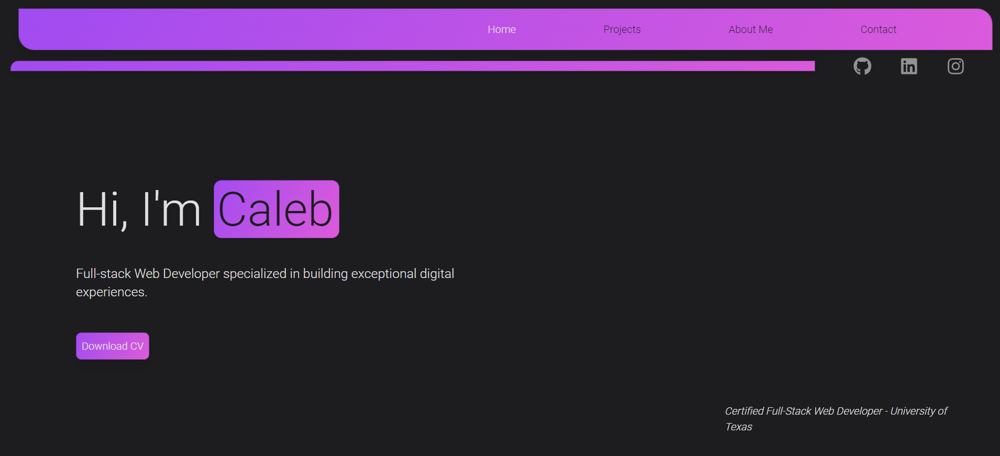

# KodaCaleb Personal Portfolio

[](https://opensource.org/licenses/MIT)


This is my personal portfolio website. The site was built using React, and styled using tailwindcss. The site is deployed using Vercel. This site shows my projects, skills, and a way to contact me if you are interested in working with me.



Deployed application: [Link to the live app](kodacaleb.dev)

## Table of Contents

1. [Technologies Used](#technologies-used)
3. [Installation](#installation)


## Technologies Used

- React
- React Router
- TailwindCSS
- FormSpree
- Vercel
- Node
- Framer Motion
- React Icons
- React Transition Group


## Installation

Provide the steps needed for installing your project. Here is an example:

1. Clone the repository

   ```
   git clone
    ```
2. Install dependencies

   ```
   npm install
   ```
3. Start the server

   ```
    npm start
    ```
4. Open browser to localhost:3000

